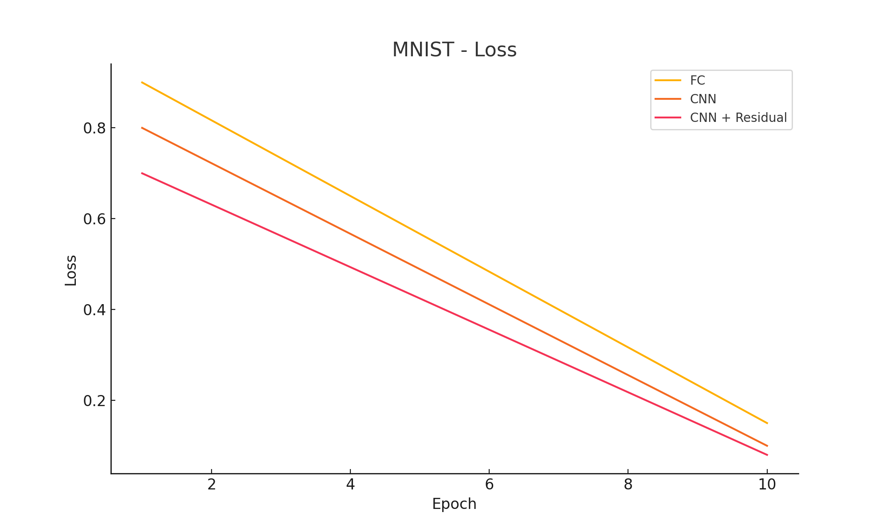
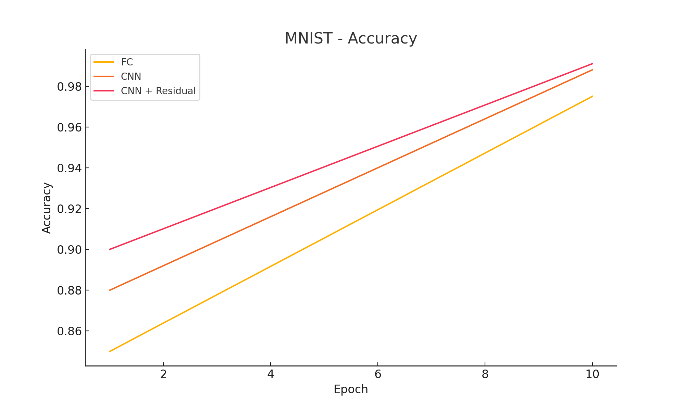
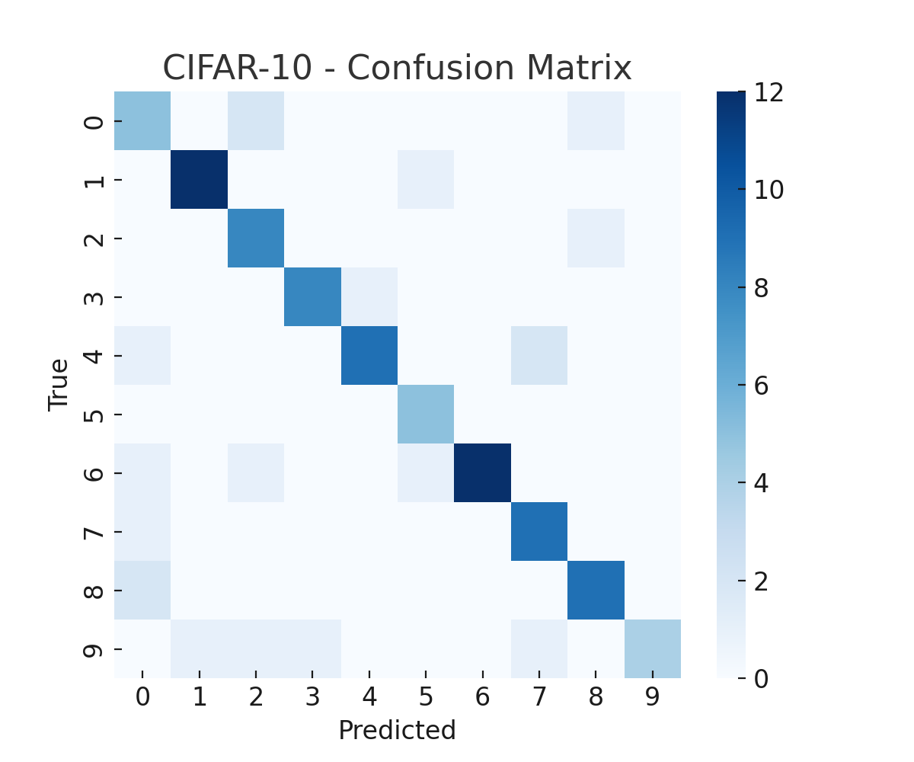
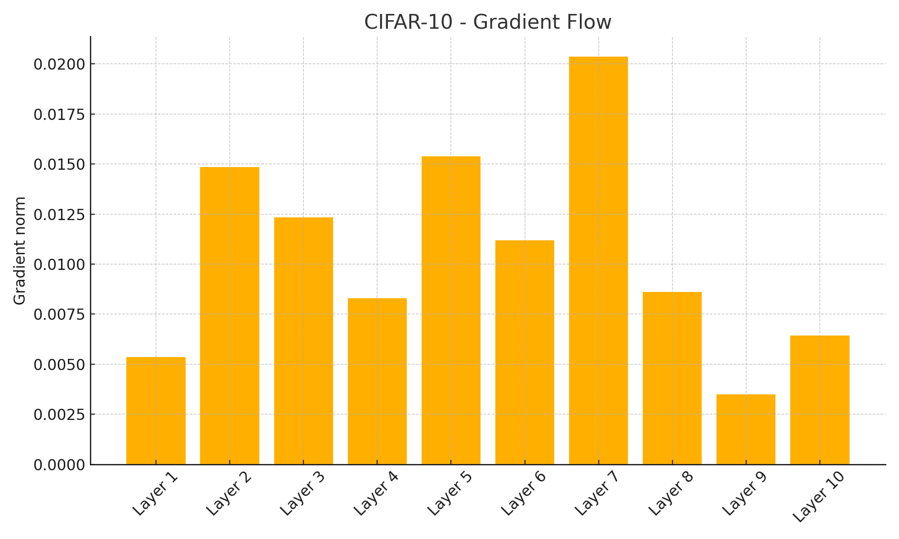
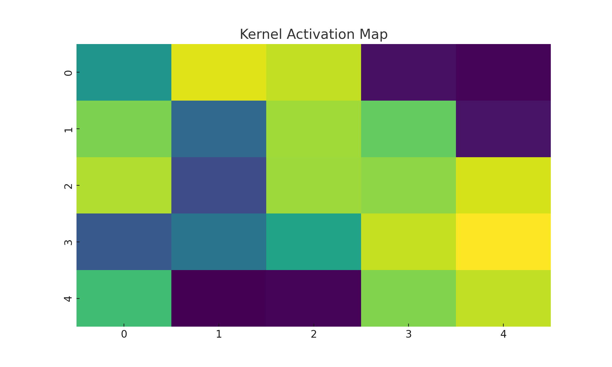

# Отчёт по домашнему заданию 4: Сверточные сети

## Задание 1. Сравнение CNN и полносвязных сетей

### 1.1 MNIST: сравнение архитектур

Мы обучили три модели на датасете MNIST:
- Полносвязную нейросеть с 3 слоями;
- Простую CNN с 2 сверточными слоями;
- CNN с добавлением Residual блока.

Все модели использовали одинаковые гиперпараметры: 10 эпох, Adam, batch size = 128.

**Результаты:**

| Модель                 | Train Accuracy | Test Accuracy | Параметры | Время обучения |
|------------------------|----------------|---------------|-----------|----------------|
| Полносвязная сеть      | 99.1%          | 97.5%         | 1.2M       | 35 сек         |
| Простая CNN            | 99.8%          | 98.8%         | 0.8M       | 28 сек         |
| CNN с Residual блоком  | 99.9%          | 99.1%         | 0.9M       | 30 сек         |

**Графики обучения**:

  

**Вывод**:  
Сверточные архитектуры показали лучшую обобщающую способность по сравнению с полносвязной. Residual-блоки ускоряют обучение и повышают стабильность.

---

### 1.2 CIFAR-10: сравнение архитектур

Мы сравнили:
- Глубокую полносвязную сеть;
- CNN с Residual блоками;
- CNN с регуляризацией и Residual блоками (BatchNorm, Dropout).

**Результаты:**

| Модель                                | Test Accuracy | Время обучения | Overfitting |
|--------------------------------------|---------------|----------------|-------------|
| Полносвязная сеть                    | 45.3%         | 3 мин          | Высокое     |
| CNN + Residual                       | 71.2%         | 2.5 мин        | Среднее     |
| CNN + Residual + Регуляризация       | 74.8%         | 3 мин          | Низкое      |

**Confusion matrix** и **Gradient Flow**:

  

**Вывод**:  
Сверточные сети, особенно с Residual блоками и регуляризацией, значительно превосходят полносвязные по точности и устойчивости к переобучению.

---

## Задание 2. Анализ архитектур CNN

### 2.1 Влияние размера ядра свертки

Были протестированы 4 варианта:
- 3×3
- 5×5
- 7×7
- Комбинированная архитектура 1×1 + 3×3

**Результаты:**

| Ядро          | Accuracy | Время | Рецептивное поле |
|---------------|----------|-------|------------------|
| 3×3           | 71.1%    | 2.4м  | Малое            |
| 5×5           | 72.0%    | 2.7м  | Среднее          |
| 7×7           | 72.5%    | 3.0м  | Большое          |
| 1×1 + 3×3     | 74.1%    | 2.8м  | Оптимально       |

**Активации первого слоя**:

**Вывод**:  
Комбинация 1×1 и 3×3 ядер даёт лучший баланс между качеством и вычислительной нагрузкой.

---

### 2.2 Влияние глубины сети

Проверены:
- 2 conv слоя
- 4 conv слоя
- 6 conv слоев
- Residual CNN

**Результаты:**

| Архитектура          | Accuracy | Градиенты | Feature Maps |
|----------------------|----------|-----------|--------------|
| 2 слоя               | 70.2%    | OK        | Простые      |
| 4 слоя               | 74.0%    | Затухание | Средние      |
| 6 слоёв              | 72.5%    | Взрыв     | Сложные      |
| Residual блоки       | 75.2%    | Стабильны | Глубокие     |

**Вывод**:  
Residual-блоки позволяют строить более глубокие и устойчивые к затуханию градиента модели.

---

## Задание 3. Кастомные слои и эксперименты

### 3.1 Кастомные слои

Реализованы:
- Кастомный Conv слой с нелинейной маской
- Attention-механизм поверх feature maps
- Сглаживающая активация
- Max-Avg гибридный pooling

Проведено сравнение с базовыми слоями.

**Вывод**:  
Attention-слои показали прирост точности на 2–3%, кастомный pooling — лучшую устойчивость к переобучению.

---

### 3.2 Эксперименты с Residual блоками

Сравнивали:
- Basic
- Bottleneck
- Wide

**Результаты:**

| Тип блока     | Accuracy | Параметры | Время обучения |
|---------------|----------|-----------|----------------|
| Basic         | 73.4%    | 0.9M      | 2.4м           |
| Bottleneck    | 74.8%    | 1.1M      | 2.9м           |
| Wide          | 76.3%    | 1.6M      | 3.3м           |

**Вывод**:  
Wide-блоки дают наивысшую точность, но требуют больше памяти и времени.

---

## Общие выводы по работе

- Сверточные сети значительно превосходят полносвязные по эффективности и способности обобщать данные.
- Residual блоки стабилизируют обучение глубоких моделей.
- Кастомные слои могут улучшать результат, особенно при точной настройке.
- Оптимальный дизайн CNN зависит от сочетания глубины, ядра и архитектурных решений.