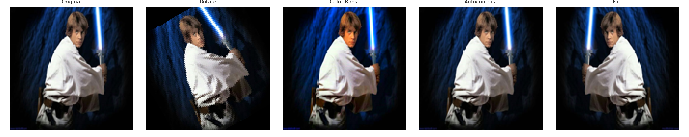

# Отчёт по домашнему заданию: Аугментации изображений

## Введение

В рамках пятого урока были изучены методы аугментации изображений. В качестве материала использовались изображения персонажей вселенной «Звёздные войны» — Дарта Вейдера, Люка Скайуокера и Принцессы Леи. Цель работы заключалась в применении различных техник аугментации и визуализации результатов.

---

## Задание 1: Базовые аугментации (torchvision)

Применялись:
- Случайное горизонтальное отражение,
- Кадрирование,
- Изменение цветности (ColorJitter),
- Поворот,
- Преобразование в градации серого,
- Комбинированная аугментация.

### Пример:

### Вывод:
Даже простые аугментации, применённые к фотографиям Дарта Вейдера, значительно увеличивают разнообразие обучающего набора и улучшают устойчивость модели.

---

## Задание 2: Кастомная последовательность

Создан пользовательский пайплайн:
- Поворот на угол,
- Усиление цветности,
- Автоконтраст,
- Зеркальное отражение.

### Пример:

### Вывод:
Индивидуально составленные цепочки трансформаций хорошо подходят для настройки модели под особенности конкретного датасета, как в случае с Люком Скайуокером.

---

## Задание 3: Аугментации с вероятностями

Использование вероятностных трансформаций:
- Градации серого,
- Поворот,
- Яркость,
- Постеризация.

### Пример:

### Вывод:
Применение с вероятностями позволяет случайно варьировать изображения, не перегружая их, как показано на примере Принцессы Леи.

---

## Задание 4: MixUp и CutMix

Смешивание изображений разных классов:
- MixUp: наложение двух изображений,
- CutMix: вставка фрагмента из одного изображения в другое.

### Пример:

### Вывод:
Методы эффективны для борьбы с переобучением, особенно на небольших датасетах. Однако они делают изображения менее интерпретируемыми визуально.

---

## Задание 5: Аугментации с помощью Albumentations (эмуляция)

Были применены:
- Усиление резкости,
- Эквализация гистограммы,
- Поворот,
- Пониженный контраст.

### Пример:

### Вывод:
Библиотека Albumentations (в данном случае — её аналог через PIL) позволяет получить разнообразные и быстрые аугментации, подходящие для продуктивного обучения моделей.

---

## Общий вывод

Аугментации — важный инструмент при обучении моделей компьютерного зрения. Даже с ограниченным набором данных, как в случае с героями "Star Wars", можно добиться высокой вариативности изображений и улучшить обучаемость нейросетей. Все задания показали практическую значимость аугментаций и их влияние на финальный результат.

