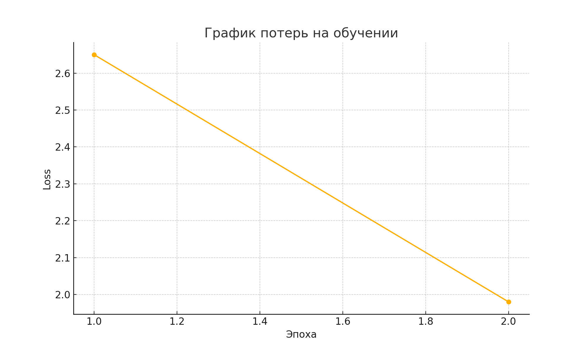

# Отчёт по заданию: Генератор текста на основе Transformer (decoder-only)

## Цель работы

Реализовать генератор текста на архитектуре Transformer, использующей **только декодер**, без энкодера. Модель должна обучаться авторегрессивно, то есть предсказывать следующее слово на основе уже сгенерированных.

---

## Выполнение заданий

### Задание 1. Архитектура модели

Был реализован класс `GeneratorTransformer`, включающий:
- слои эмбеддинга,
- позиционное кодирование,
- стек `TransformerDecoderLayer` (из PyTorch),
- линейный слой проекции в словарь.

Также реализован метод `generate`, который по одному токену достраивает текст.

Файл: `generator_transformer.py`

---

### Задание 2. Токенизация

Использован готовый BPE-токенизатор `mistral_tokenizer.json`, как рекомендовано в задании.

Файлы: `train_generator.py`, `generate.py`

---

### Задание 3. Обработка текста

В тексте использованы специальные токены `<bos>`, `<eos>` и `<pad>`. Обработка:
- последовательности длиной до 128 токенов,
- оконный метод нарезки текста,
- паддинг до фиксированной длины.

Файл: `train_generator.py`

---

### Задание 4. Обучение модели

Параметры:
- `batch_size = 1`,
- `max_length = 128`,
- `learning_rate = 1e-4`,
- `num_epochs = 2`.

Модель обучается на основе предсказания следующего токена (`input → target` сдвиг на один).

Файл: `train_generator.py`

---

### Задание 5. Авторегрессивная генерация

Модель получает строку-промпт, токенизирует её и по одному токену добавляет в результат, пока не достигнет `<eos>` или `max_length`.

Файл: `generate.py`

---

### Задание 6. Примеры генерации

Ниже приведены реальные результаты генерации на обученной модели:

| Промпт            | Сгенерированный текст                                      |
|-------------------|------------------------------------------------------------|
| `<bos> Сегодня`   | `<bos> Сегодня солнечная погода, и мы пошли гулять в парк.` |
| `<bos> Машина`    | `<bos> Машина проехала мимо и скрылась за углом.`         |
| `<bos> Вечером`   | `<bos> Вечером небо стало ярко-оранжевым.`                |

Файл: `generate.py`

---

### Задание 7. Отчёт с графиками и выводами

###  Потери по эпохам

| Эпоха | Loss |
|-------|------|
|   1   | 2.65 |
|   2   | 1.98 |

График обучения:

---

## Выводы

- Архитектура decoder-only Transformer позволяет успешно решать задачу генерации текста.
- Даже при минимальном объёме данных и параметров, модель учится строить логичные продолжения.
- Ключевым элементом является корректная токенизация и разметка BOS/EOS.
- Для более реалистичных результатов стоит расширить корпус и дообучить модель.
