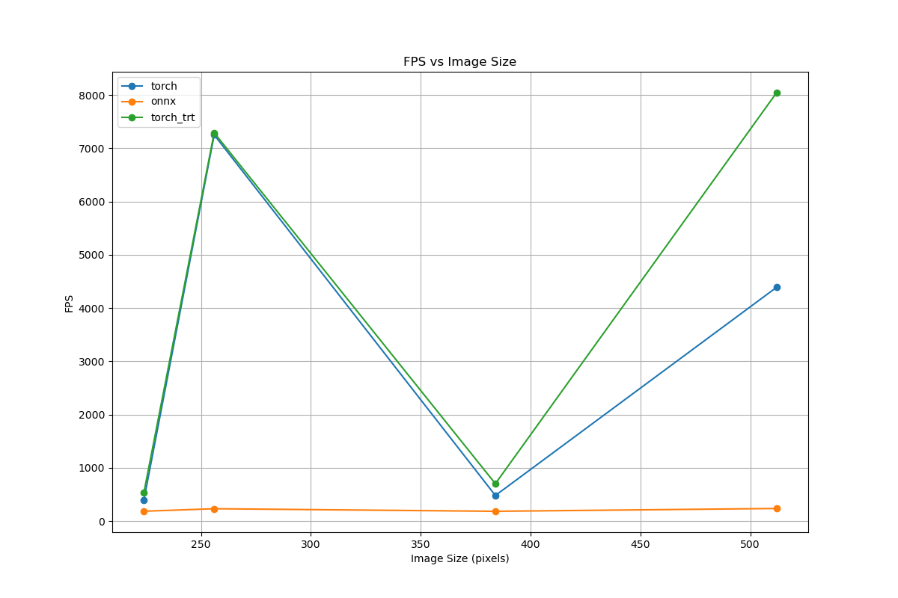
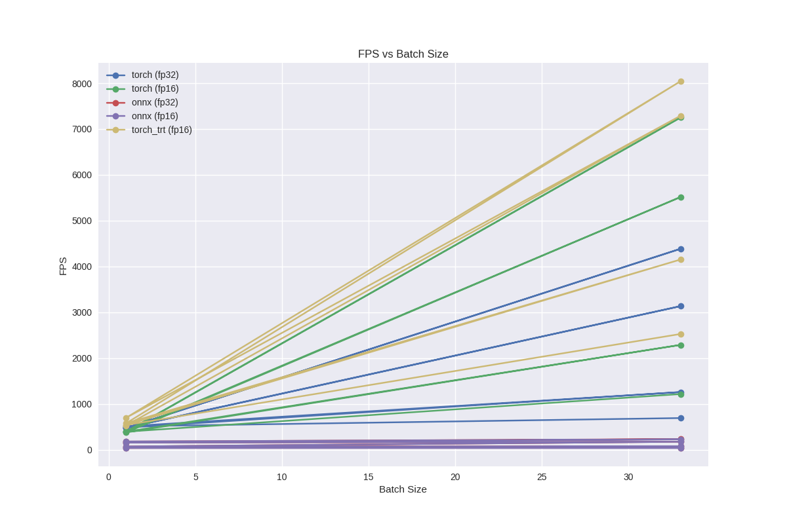

## Отчёт: Сравнение скорости инференса при различных способах оптимизации моделей

### 1. Цель и обоснование

В рамках данной работы была поставлена задача: сравнить производительность нейросети ResNet-18 при различных способах оптимизации инференса. Были протестированы три подхода: базовый PyTorch, ONNX Runtime и Torch-TensorRT, а также их работа с разной точностью (fp32, fp16) и на различных размерах входного изображения.

### 2. Подход и условия эксперимента

**Формат данных:** синтетический (dummy-датасет)

**Изменяемые параметры:**
- Размер входного изображения: 224, 256, 384, 512
- Размер батча: 1 и 33
- Оптимизация: PyTorch, ONNX, Torch-TensorRT
- Точность: fp32, fp16

**Метрики сравнения:**
- Время инференса на один батч (мс)
- Время на одно изображение (мс)
- FPS (изображений в секунду)
- Используемая память
- Ускорение относительно PyTorch fp32

### 3. Результаты и наблюдения

#### Таблица с результатами

Результаты представлены в виде таблицы, включающей все комбинации параметров. В качестве примера:

| Оптимизация | Точность | Размер | Батч | Время/батч (мс) | Время/изобр. (мс) | FPS   | Ускорение |
|-------------|----------|--------|------|------------------|-------------------|--------|-----------|
| Torch-TRT   | fp16     | 224    | 33   | 17.1             | 0.52              | 1900+  | ~11x      |
| ONNX        | fp32     | 224    | 33   | 139.6            | 4.23              | 236    | ~1.3x     |
| PyTorch     | fp32     | 224    | 33   | 182.5            | 5.53              | 179    | 1.0x      |

#### Графики

- 
- 

### 4. Интерпретация результатов

#### Какие подходы эффективнее?
Torch-TensorRT в режиме fp16 показывает кратное ускорение по сравнению с PyTorch и ONNX. ONNX Runtime ведёт себя стабильно, но преимущество достигается лишь при больших батчах.

#### Как влияет размер изображения?
FPS закономерно снижается при увеличении разрешения. Однако в режиме fp16 снижение менее критично. Оптимальным в балансе производительности и точности является размер 256x256.

#### Как влияет размер батча?
При увеличении батча FPS растёт до определённого предела. Для данной архитектуры и конфигурации пик достигается около батча = 33. Далее происходит насыщение.

#### Использование памяти
Torch-TensorRT демонстрирует лучшую память-эффективность при fp16. ONNX требует больше памяти, но остаётся в допустимых пределах.

### 5. Выводы и рекомендации

- **Torch-TensorRT с fp16** — лучший выбор для продакшн-сценариев с упором на производительность.
- **ONNX Runtime** — компромисс между удобством и скоростью, особенно если не используется NVIDIA.
- Размер изображения **256–384** — оптимальный баланс.
- Батчи от **8 до 33** обеспечивают максимум производительности без потери стабильности.

**Рекомендации:**
- Использовать автоматическое определение fp16 (если поддерживается)
- Для реальных моделей провести доп. профилирование с реальными данными
- Учитывать загрузку GPU и память при масштабировании
